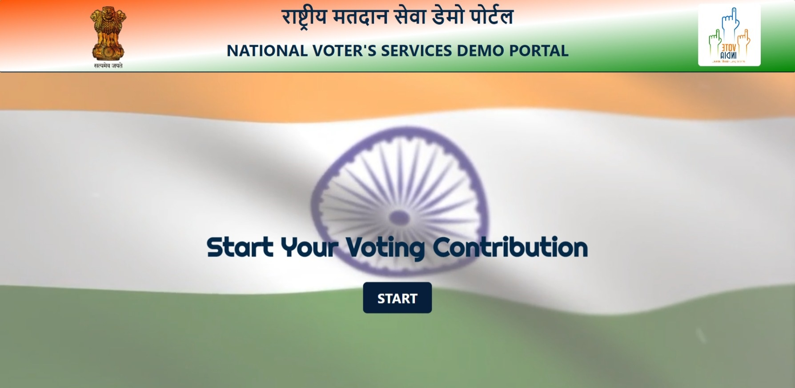
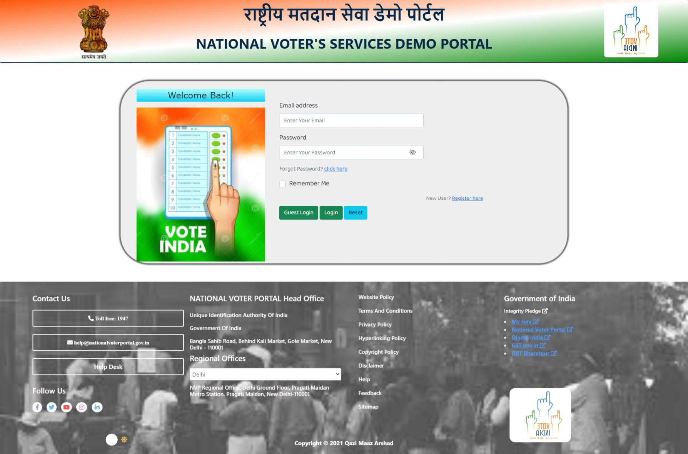
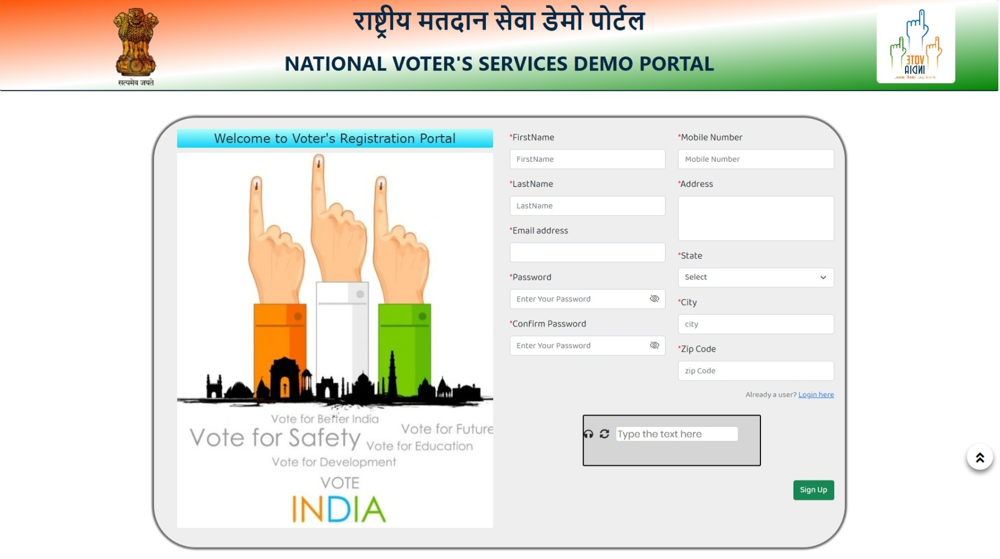
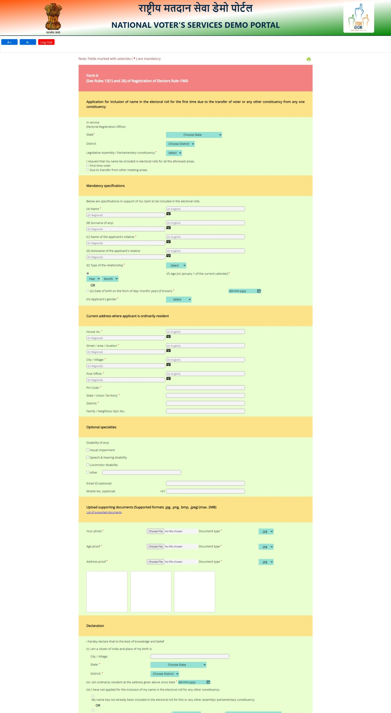
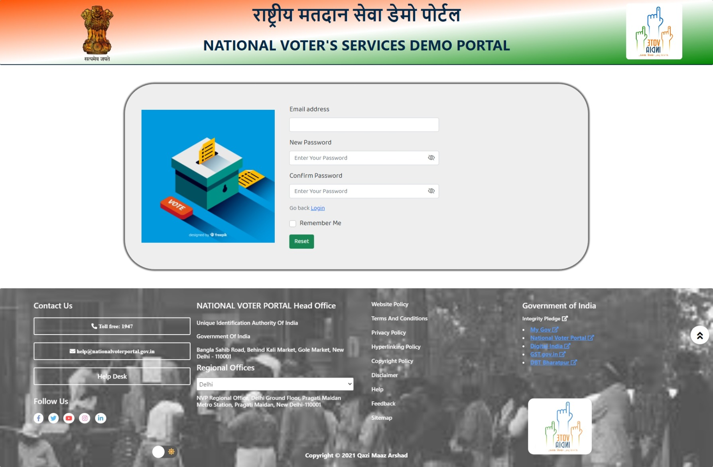
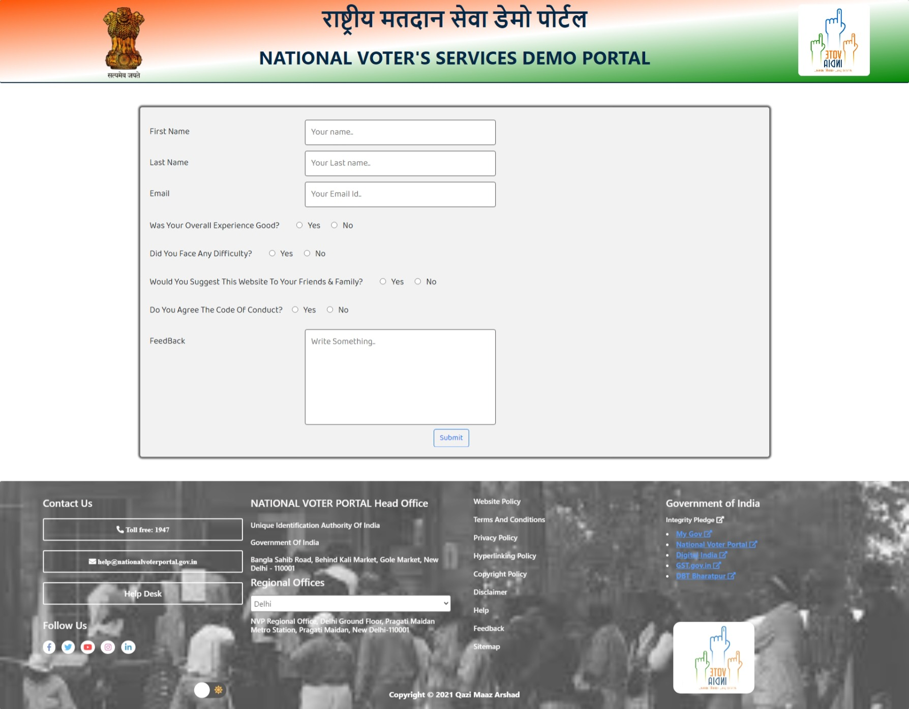
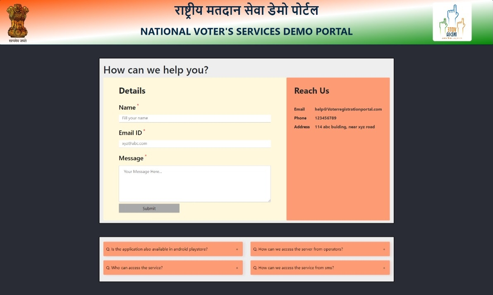

# Voter's Registration Portal 🗳️

Voting is a great power in the hands of citizens. Voting is an opportunity for change. But to contribute to that change you need to register yourself as an eligible voter.

But where and how to register? 

Don't worry, now you don't need to circle around government office. All you need is a proper internet connection and a device, because you can do it online at voter registration portal 🙌

## A sneak peek into what we have here:

## About

This is a demo website of National Voters' Registration portal. All Indian citizens who are eligible to vote can register themselves on this website to get their voter ID's. This portal allow users to fill (Form 6 of Electors Rule-1960) an application for inclusion of name in electoral roll.

## Tech Stack

